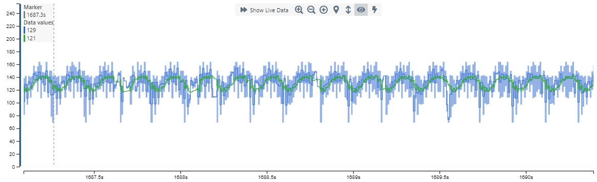
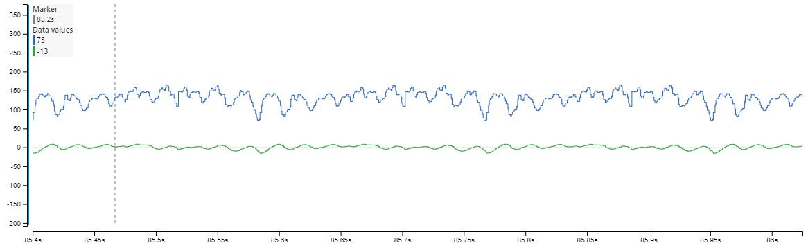

# IIR Filter


**MPLAB® X has been used to create this project.**
Source: https://github.com/wooters/miniDSP and https://webaudio.github.io/Audio-EQ-Cookbook/audio-eq-cookbook.html


The filter can be configured to use the filters below:

Filters                  | Enum                     |
-----------------------  | -----------------------  | 
Low Pass Filter          | LPF                      |
High Pass Filter         | HPF                      |
Band Pass Filter         | BPF                      |
Notch Filter             | NOTCH                    |
Peaking Band EQ Filter   | PEQ                      |
Low Shelf Filter         | LSH                      |
High Shelf Filter        | HSH                      |

Note: *Only the initilization time of the filter will be affected when choosing the filter type.*

## Cycle Times - Data types

The filter can be configured to other data types, this can be done in `filters/biquad.h`

```c
/* whatever sample type you want */
typedef float smp_type;

```

Can for example be changed to 
```c
/* whatever sample type you want */
typedef double smp_type;

```
The cycle times accomplished when using `BiQuad(sinevalue, bq);` is listed below:

type     | cycles | 
---------| ------ |
float    | 252    |
double   | 1440   |


## Graph of audio signal

Switch between for example Low Pass and Band pass by setting `FILTER_TYPE` to one of the configurations below:

```c
#define FILTER_TYPE LPF

```
or 
```c
#define FILTER_TYPE BPF

```

Only Low Pass and Band Pass filter will be tested here:
The green graph is the filtered result and the blue is the original. 
### Low Pass Filter

A low pass filter is a filter that passes the signals lower than a certain frequency threshold _freq_ and attentuates / rejects the signal outside that range. Often, for filters with high/low discrimination, the term "bandwidth" denotes that frequency threshold (think of a low pass filter as a "bandpass from zero to _bandwidth_", and a high pass filter being a "band pass from _bandwidth_ to infinity"). Here, the variable _bandwidth_ determines the shape of the transition between high/low areas. 
The variable _srate_ helps to determine the phase (_omega_) between samples.


```c
    smp_type freq = 8.0;                    // Frequency in Hertz
    smp_type srate = 255.0;                 // Samples per second
    smp_type bandwidth = 5.0;               // Bandwidth in Octaves
```
Note that the bandwidth is configured in Octaves. 
A calculator can be used here at the bottom of the page:
http://www.sengpielaudio.com/calculator-cutoffFrequencies.htm
to find **Quality Factor**.

**Quality Factor** can be used to calculate bandwidth here:
http://www.sengpielaudio.com/calculator-bandwidth.htm

For example:
```
Center Frequency = 12
Bandwidth in Hertz: Highest difference between signal 
Since this signal is a continous 12 Hz signal, it would be 12 max -12 min = 0 hz
Quality Factor -> 1
```



### Band Pass Filter

A band pass filter is a filter that rejects or attenuates signals outside of a certain frequency range and accepts it inside. 

Ideally a band pass filter should not attentuate or amplify signals inside the range and completely remove the signal outside the frequency range. 
The center frequency of the band pass filter is determined by _bandwidth


```c
    smp_type freq = 3.0;                    // Frequency in Hertz
    smp_type srate = 255.0;                 // Samples per second
    smp_type bandwidth = 1;               // Bandwidth in Octaves
```




## Data Visualizer / Timing

The graphing was done using MPLAB® Data Visualizer, which can be accomplished by updating **main.c**.  Config for **Data Visualizer** can be found in the project called `data_visualizer.json`.

The config can be loaded by clicking "*Load Workspace*" at the top of the Data Visualizer and connecting to the correct COM-port.

Toggling of **PB2** is done to time the iir filter when setting **ONLY_SEND_USART** to:
```c
#define ONLY_SEND_USART 0
```

Sending over USART with **115200** baud rate, is done using:
```c
#define ONLY_SEND_USART 1
```

Two values are here sent:
```
original value: uint8_t
new value: float32
```


