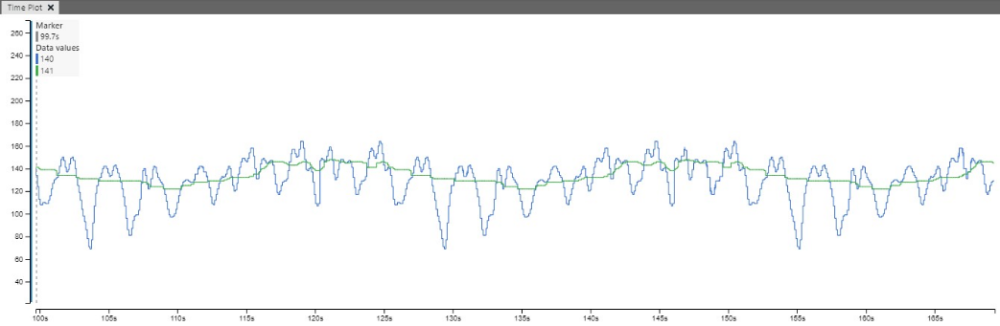

# Median filter

The Median filter is a simple idea to smooth a signal by removing spikes from the signal. The median filter can be used both on images and on 1-dimensional signal problems, which is what will be covered here. The median is calculated by having a sorted list of numbers and finding the number in the middle. The median filter has a window size, which is how far it will look back. For example a window of 15, will have 14 elements looking back and the new element, and the filter will return the median of these 15 numbers. 

This code measures the execution time of a MEDIANFILTER_Insert() function that
determines the median value of an array of values.  The size of the
median filter is determined by NUM_ELEMENTS. The filter does not function correctly for even numbered filter size, but this is easily accounted for by using odd sized filters. For median calculation of even sized filters as opposed to odd filters, middle is two numbers and the calculation would be `two middle numbers / 2`.

The main code first initializes PORT D 6 as an output. A while loop generates a new integer value to be fed as input to the median filter. The PD6 output is set, and then the median filter is called. Just after the median filter, the PD6 output is cleared. Thus, an oscilloscope or a logic analyzer can be connected to the PD6 pin of the device, and the execution time of the MEDIANFILTER_Insert() function can be determined by measuring the duration of the high-level pulse.

To be able to visualize this the data is transferred on usart3.

## Median filter - Visualization

The green is the filtered signal and the blue is the original signal. Using the MPLAB® Data Visualizer to compare the two signals sent over the Universal Synchronous and Asynchronous Receiver and Transmitter - USART, it is a clear difference between the two. The median filter removes the spikes in the signal and the signal ends with the median of the current signal. In this case the filtered signal results in a cleaner sine wave. 

## Cycle Times

| Filter Size   | Cycles                    |
| ------------- | ------------------------- |
| 7             | 215 - 385.8               |
| 15            | 225.8 - 601.8             |
| 31            | 344.8 - 1034              |

Because of the efficient implementation, a doubling in the size of the filter does not necessarily mean a doubling in number of cycles needed to run the filter. This can be verified by doing even more measurements.

## Implementation Explanation
What has been covered in this guide is how to use the median filter and shortly how it works. 

Median filter is nice method of removing noise or peaks from the signal and can often be used as a preprocessing step before other more advanced filters, for example Kalman filter. 

